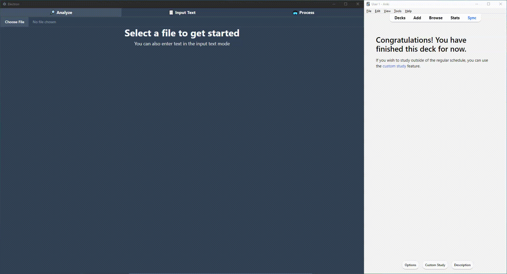

# A tool for Anki flashcard creation
AnkiHelper is a tool for rapidly creating flashcards from texts for the spaced repetition software [Anki](https://apps.ankiweb.net/).

# Usage

## Analyzing
Choose a file to start analyzing it. Once a file is selected you can see which words are most common in the text. If you select an Anki deck 
you can filter out all words that are already in that deck. 

## Flashcard creation guide
1. Select a file that you want to source text from 
2. Select a deck that you want to add flashcards to.
3. (Optional) select a translation language.
4. (Optional) filter the sentence selection you want by clicking 'Word analysis. Clicking on a word in this view will get all sentences that uses that word from the text. 
4. Click on a sentence, the cloze creation modal will open. 
5. Select one or more cloze words. An input box will open that is the hint of the cloze word. It will be pre-filled if you selected a translation language in step 3. 
6. (Optional) process the sentence with any or all process options. 
7. Click 'Create card', the card is now added to the anki deck you chose. 

# Installation
AnkiHelper runs on your windows, mac or linux device and requires Anki to be installed along with AnkiConnect. 

## AnkiConnect
Make sure that Anki is installed and running with the [AnkiConnect](https://ankiweb.net/shared/info/2055492159) add-on installed and functioning. If you have installed AnkiConnect you can navigate to [http://127.0.0.1:8765/](http://127.0.0.1:8765/) in your web-browser to make sure that it is running. For further information on AnkiConnect you can visit it's [documentation](https://foosoft.net/projects/anki-connect/).

# Limitations
AnkiHelper is under early, active development. If you encounter a bug I would appreciate if you would report it.

# Planned features
- Basic note type (currently only cloze card is supported).
- Cloze card back-side hint.
- Alternative file types: pdf, epub and mobi.

# License
This software is licensed under GNU General Public License v3.0. Read the LICENSE.txt file for more information. 